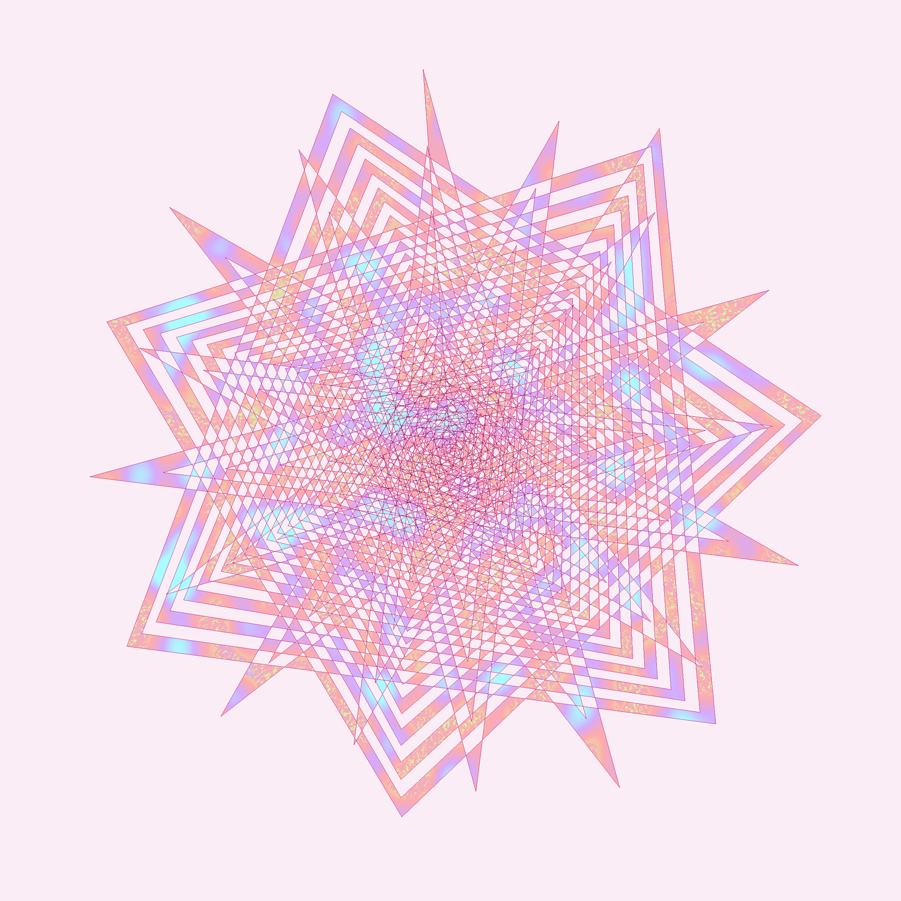
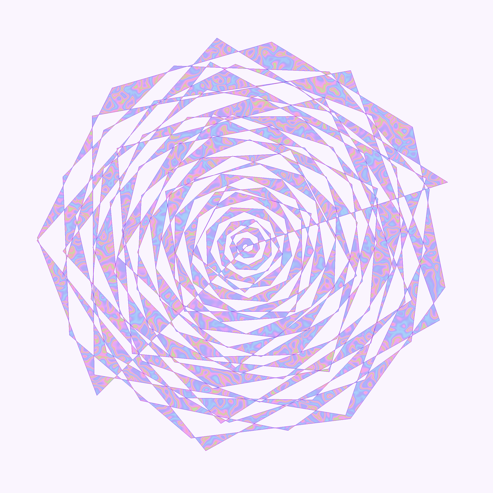
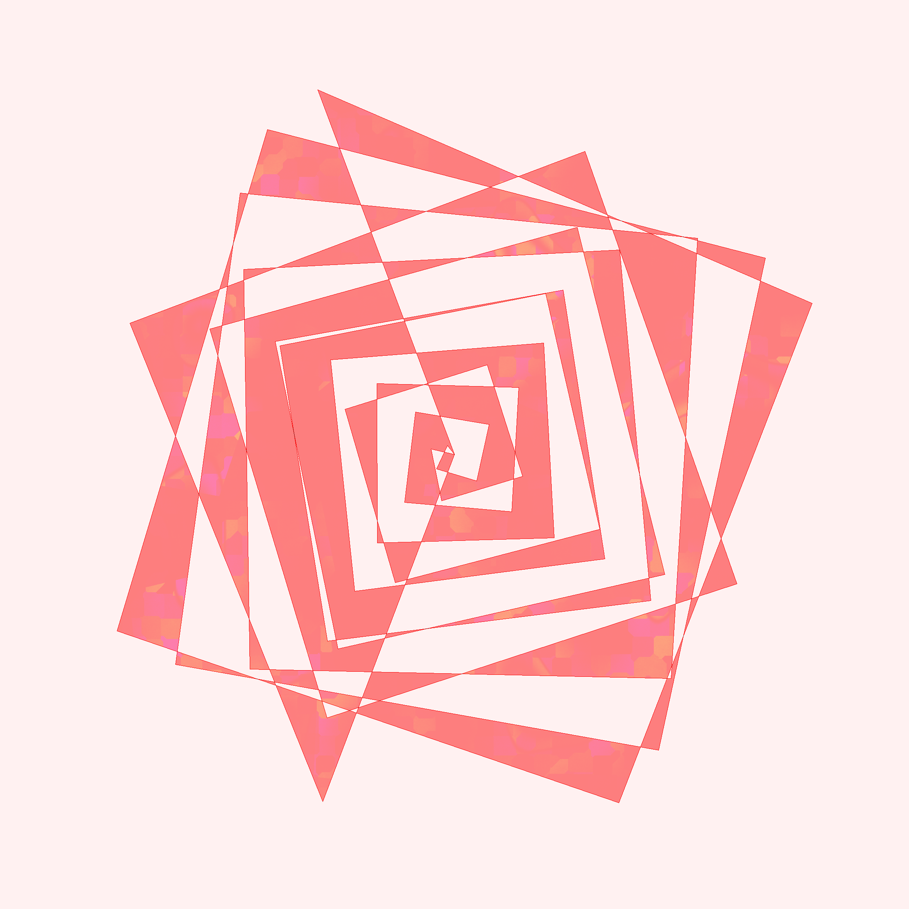
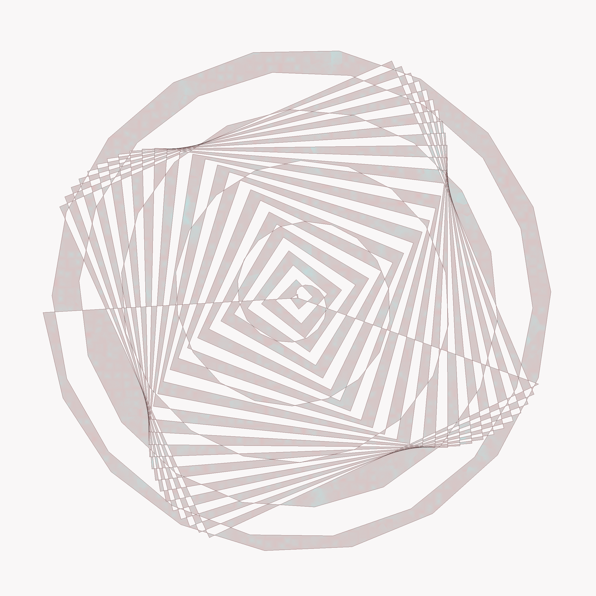
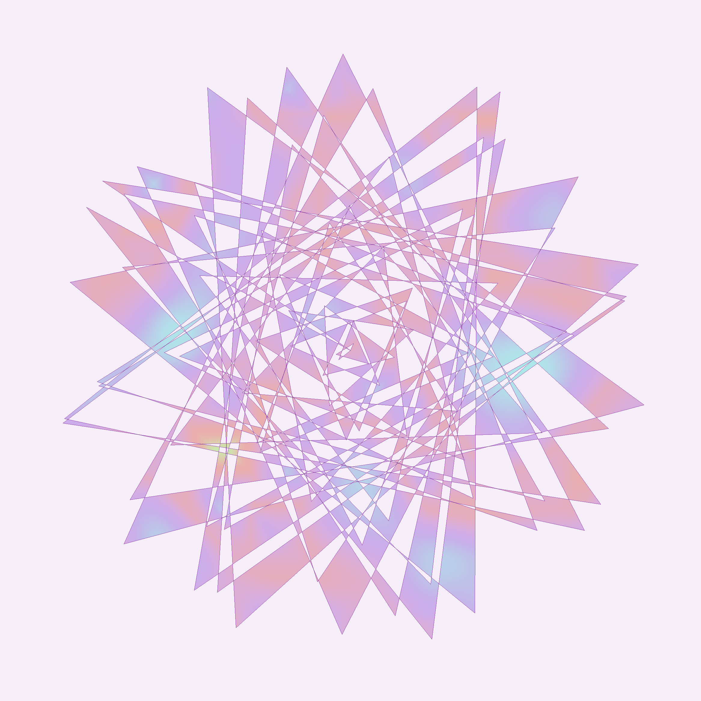
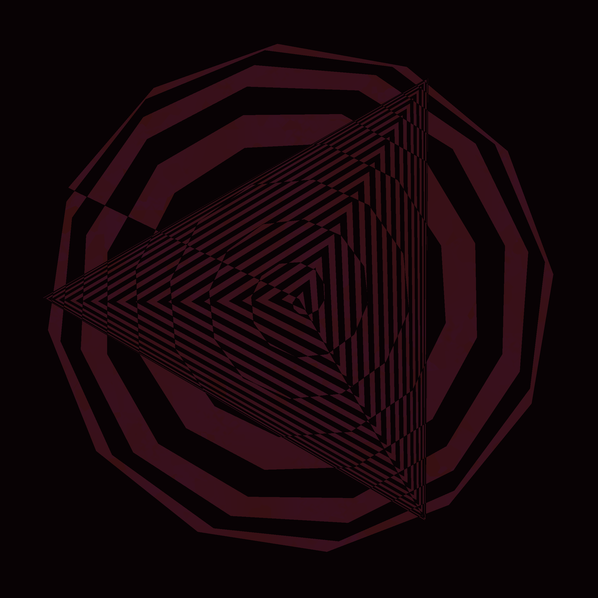
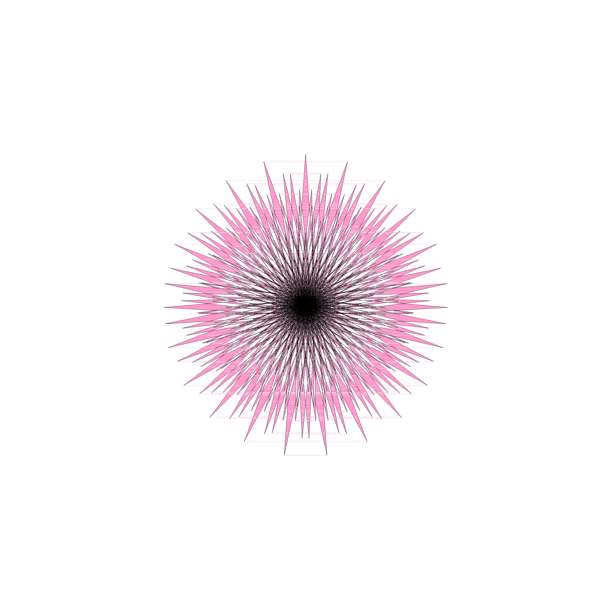

# Flowers

A library to create procedurally generated 2D flowers.

Inspired by [polar function roses](https://en.wikipedia.org/wiki/Rose_(mathematics)),
I am building a tool to produce flowers by generating and coloring them petal-by-petal. The library also provides an API
for users to override specific generation algorithms.

As this is a side project, work is still in progress. 
The library currently lacks fine-tuning for petals, image post-processing, and more mosaic algorithms.

### Fun results during the development:

#### Mosaic

Mosaics are intended to appear inside the flower (the nectaries).

(They are generated by the same polar function, but with more extreme values...)

And **A LOT** of failures, like:

